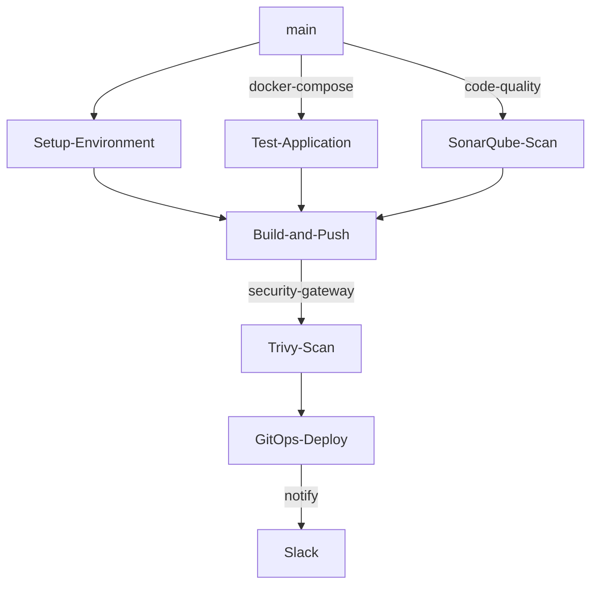

# .github
## GitHub Template Repo

## 🚦 Pipeline Workflow
This repository store the SES workflow templates.

## feature tests 
## release build-and-push, deploy
## hotfix tests , build-and-push, deploy
## main promote
